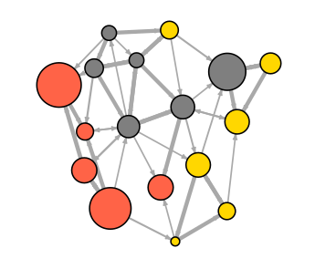

このワークショップで用いるデータは、[ここ](http://www.kateto.net/wordpress/wp-content/uploads/2016/01/netscix2016.zip)からダウンロードするか、http://kateto.net/netscix2016 から入手してください。

このチュートリアルではRのパッケージであるigraphを用いてネットワーク解析とネットワークの可視化の基本を学びます。igraphは Gabor Csardi と Tamas Nepusz によってメンテナンスされています。igraph ライブラリを使うことで、R, Python, C/C++ 言語において様々な方法でネットワークの解析や可視化ができます。このワークショップでは R での igraph を扱います。RとRStudioのインストールが必要です。また、R用のigraphの最新版もインストールしてください。Rから以下のようにタイプしていただければインストールできます。

```{r, eval=F}
install.packages("igraph")
```

## 1. Rにおける基本的な覚書

ネットワークを扱う前に、Rの基本を簡単に紹介／おさらいしておきましょう。  

### 1.1 代入

あるオブジェクトに値を代入したい時には `assign()`, `<-`, `=` のいずれかを使います。  

```{r, eval=F}
x <- 3        # xに3を代入
x             # 式の値を求め、結果を出力

y <- 4        # yに4を代入
y + 5         # 式の値を求めますが、yは4のまま

z <- x + 17*y # 代入
z             # 式の値を求める

rm(z)         # remove z: zというオブジェクトを消去
z             # zを出力しようとするとエラーが出る！
```

### 1.2 値の比較

標準的な演算子である `<`, `>`, `<=`, `>=`, `==`(等しい), `!=`(等しくない)を使うことができます。比較はブーリアン値、すなわち `TRUE` か `FALSE` を返します(単に `T` と `F` で略されることが多いです)。

```{r, eval=F}
2==2          # 等しい
2!=2          # 等しくない
x <= y        # 以下："<"や">"、">="も使える
```

### 1.3 特殊な定数  

特殊な定数には以下のようなものがあります。

- **NA**: データが欠損しているか不詳な場合
- **NULL**: 空オブジェクト(例えば、ヌル/空リスト)
- **Inf** および **-Inf**: 正と負の無限大
- **NaN**: 正確な演算結果が得られない場合

```{r, eval=F}
# NA - データが欠損しているか不詳な場合
5 + NA # 式の中で使われた場合、結果は基本的にNA
is.na(5+NA) # 欠損がないかをチェック
# NULL - NULLは空のオブジェクト(例えば、ヌル/空リスト)
10 + NULL # 空のオブジェクトを戻り値として使う(長さ0)
is.null(NULL) # NULLかどうかチェックできる
```

Infや-Infは正と負の無限大を意味します。ある数字をゼロで割った時のような数学的演算で返されます。  

```{r, eval=F}
5/0
is.finite(5/0) # その数字が有限か確認(この場合は違う)
```

NaN (Not a Number)は、ゼロをゼロで割るといった適切でない演算を行った結果として出力されます。

```{r, eval=F}
0/0
is.nan(0/0)
```

### 1.4 ベクトル

ベクトルはRにおける重要な関数である `c()` を使って作図できます。

```{r, eval=F}
v1 <- c(1, 5, 11, 33)      # 要素数4の実数ベクトル
v2 <- c("hello","world")   # 要素数2の文字列ベクトル
v3 <- c(TRUE, TRUE, FALSE) # 論理値ベクトルで、c(T, T, F)と同じ
```

単一のベクトルに異なった要素の型が混じっていると、最も制限の緩い型の要素になります：
```{r, eval=F}
v4 <- c(v1,v2,v3,"boo") # 全ての要素は文字列として扱われる
```

ベクトルを生成するその他の方法として以下の方法があります：

```{r, eval=F}
v <- 1:7               # c(1,2,3,4,5,6,7)と同じ
v <- rep(0, 77)        # 0を77回繰り返す：vは77個のゼロを持ったベクトル
v <- rep(1:3, times=2) # 1,2,3を2回繰り返す
v <- rep(1:10, each=2) # 各々の要素を2回繰り返す
v <- seq(10,20,2)      # sequence関数；10から20の間で2ずつ異なる数列

v1 <- 1:5              # 1,2,3,4,5
v2 <- rep(1,5)         # 1,1,1,1,1
```

あるベクトルの長さを確認したい時は：

```{r, eval=F}
length(v1)
length(v2)
```

要素ごとの操作:

```{r, eval=F}
v1 + v2     # 要素ごとの足し算
v1 + 1      # それぞれの要素に1を加える
v1 * 2      # それぞれの要素に2をかける
v1 + c(1,7) # (1,7) はv1と長さの異なるベクトルであるためうまくいかない
```

数式操作:

```{r, eval=F}
sum(v1)      # 全ての要素の合計
mean(v1)     # 全ての要素の平均
sd(v1)       # 標準偏差
cor(v1,v1*5) # v1とv1*5の相関
```

論理操作:

```{r, eval=F}
v1 > 2 # それぞれの要素を2と比較し、論理値ベクトルを返す
v1==v2 # それぞれの要素の一致を照合し, 論理値ベクトルを返す
v1!=v2 # それぞれの要素の不一致を照合(!(v1==v2)と同様)
(v1>2) | (v2>0) # |はブーリアンのORを意味し、ベクトルを返す
(v1>2) & (v2>0) # &はブーリアンのANDを意味し、ベクトルを返す
(v1>2) || (v2>0) # ||はブーリアンのORを意味し、単一値を返す
(v1>2) && (v2>0) # &&はブーリアンのANDを意味し、単一値を返す
```

ベクトルの要素:

```{r, eval=F}
v1[3] # v1の3番目の要素
v1[2:4] # v1の2から4番目の要素
v1[c(1,3)] # 要素1と3(note that your indexes are a vector)
v1[c(T,T,F,F,F)] # 要素1と2(TRUE値のみ返す)
v1[v1>3] # v1>3は3より大きい要素をTRUEとする論理値ベクトル
```

Rにおけるインデックスは1から始まりますので、0からインデックスする言語を使っていた人たちは混乱したり動揺したりするかもしれません。
あるベクトルにさらなる要素を付け加える場合は、単純に値を割り当てればよいです。

```{r, eval=F}
v1[6:10] <- 6:10
```

ベクトルに長さをそのまま割り当てることもできます。
```{r, eval=F}
length(v1) <- 15 # the last 5 elements are added as missing data: NA
```

### 1.5 要因ベクトル

要因ベクトルはカテゴリーデータを格納する時に用います。

```{r, eval=T}
eye.col.v <- c("brown", "green", "brown", "blue", "blue", "blue") #ベクトル
eye.col.f <- factor(c("brown", "green", "brown", "blue", "blue", "blue")) #要因ベクトル
eye.col.v
```

```{r, eval=T}
eye.col.f
```

```
## [1] brown green brown blue blue blue
## Levels: blue brown green
```

Rでは要因factorの異なる水準level(それぞれ別の値：blue, brown, green)を特定します。個々の水準は整数値として内的に格納され、各々の数字と要素の水準が対応しています。

```{r, eval=T}
levels(eye.col.f) # 要因(カテゴリカル変数)における各水準(別々の値)
```

```{r, eval=T}
as.numeric(eye.col.f) # 数値としては 1がblue, 2がbrown, 3がgreenに対応
```

```{r, eval=T}
as.numeric(eye.col.v) # 文字ベクトルを強制的に数値にすることはできない

```

```{r, eval=T}
as.character(eye.col.f)
```

```{r, eval=T}
as.character(eye.col.v)
```

### 1.6 行列と配列

行列は次元をもったベクトルです。

```{r, eval=F}
m <- rep(1, 20) # 全てが1の20個の要素からなるベクトル
dim(m) <- c(5,4) # 次元は5と4に設定されているので、ここでのmは5行4列の行列
```

matrix()を使って、ある行列を作ってみましょう。
```{r, eval=T}
m <- matrix(data=1, nrow=5, ncol=4) # 上の行列と同じで、5行4列の全てが1の行列
m <- matrix(1,5,4) # 同上
dim(m) # mの次元はいくつか？
```

ベクトルを組合せて行列を作ってみましょう。
```{r, eval=F}
m <- cbind(1:5, 5:1, 5:9) # 3つのベクトルを列としてまとめ、5行3列 の行列にする
m <- rbind(1:5, 5:1, 5:9) # 3つのベクトルを行としてまとめ、3行5列 の行列にする
```

行列の要素を選びましょう。
```{r, eval=F}
m <- matrix(1:10,10,10)
m[2,3] # 行列mの第2行、第3列にある単一のセルを選択
m[2,] # 行列mの2行目全体を1つのベクトルとして
m[,2] # 行列mの2列目全体を1つのベクトルとして
m[1:2,4:6] # 1行目と2行目、4列目から6列目の部分行列
m[-1,] # 最初の1行"を除く"すべての行
```

行列を用いたその他の操作です。
```{r, eval=F}
m[1,]==m[,1] # 1行目の要素が、対応する1列目の要素と等しいか
m>3 # 行列mの要素が3より大きければTRUEを、さもなくばFALSEを返す論理値行列
m[m>3]# TRUE要素、すなわち3より大きい要素のみ選択
```

```{r, eval=F}
t(m) # 行列mの行と列を入れ替え (移項transpose)
m <- t(m) # 移項したmを新たな行列mとする
m %*% t(m) # %*%で行列の乗算
m * m # *で要素ごとの乗算
```

配列は、次元が2以上の時に用います。array()機能を用いて作成できます：
```{r, eval=F}
a <- array(data=1:18,dim=c(3,3,2)) # 3x3x2の3次元配列
a <- array(1:18,c(3,3,2)) # 上と同様の配列を意味
```


### 1.7 リスト

リストはオブジェクトの集合です。1つのリストにあらゆる種類の要素、すなわち文字列、数値ベクトル、行列、別のリストなどを入れることができます。こうすることで、リストにある要素に簡単にアクセスできます。

```{r, eval=F}
l1 <- list(boo=v1,foo=v2,moo=v3,zoo="Animals!") # 4つのコンポーネントからなるリスト
l2 <- list(v1,v2,v3,"Animals!")
```

空リストを作ってみましょう。
```{r, eval=F}
l3 <- list()
l4 <- NULL
```

リストの要素にアクセスしてみましょう。
```{r, eval=F}
l1["boo"] # シングルブラケットでbooにアクセスすると、リストを返す
l1[["boo"]] # ダブルブラケットでbooにアクセスすると、数値ベクトルを返す
l1[[1]] # リストの最初のコンポーネントを返すので、上と同じ意味
l1$boo # $作用素を用いると、ダブルブラケットと同じように名前のついた要素にアクセスできる
```

リストにさらなる要素を付け加えましょう。
```{r, eval=F}
l3[[1]] <- 11 # 空のリストl3に要素を加える
l4[[3]] <- c(22, 23) # 空のリストl4の3つ目の要素としてベクトルを加える
```

上でリストl4の3つ目の要素にベクトルを加えたので、1つ目と2つ目の要素が生成され、空値(NULL)が与えられます。

```{r, eval=F}
l1[[5]] <- "More elements!" # リストl1には4つの要素があったので、ここで5つ目を加えた
l1[[8]] <- 1:11
```

上で8つ目の要素を加えましたが、6・7番目はなかったので、空値(NULL)が生成されます。

```{r, eval=F}
l1$Something <- "A thing" # 9番目の要素に"something"と名付けられた"A thing"が加えられた
```

### 1.8 データフレーム

データフレームとは、データセット表を保存するために用いられる特殊なリストです。行をケース、列を変数として捉えます。各々の列は単一のベクトルもしくは要因ベクトルになります。

データフレームを作ってみましょう：

```{r, eval=T}
dfr1 <- data.frame( ID=1:4,
FirstName=c("John","Jim","Jane","Jill"),
Female=c(F,F,T,T),
Age=c(22,33,44,55) )

dfr1$FirstName # dfr1の2列目にアクセス
```

Rでは `dfr1$FirstName` を1つのカテゴリー変数として認識しますので、文字列ベクトルではなく、1つの要因ベクトルとして扱われる点に注意しましょう。それではRに'FirstName'が単一ベクトルであることを伝え、この問題を解決しましょう。

```{r, eval=F}
dfr1$FirstName <- as.vector(dfr1$FirstName)
```

その他に、`stringsAsFactors=FALSE` を使うことで、最初からRに要因ベクトルはイヤだよと伝えることもできます。
```{r, eval=T}
dfr2 <- data.frame(FirstName=c("John","Jim","Jane","Jill"), stringsAsFactors=F)
dfr2$FirstName # 成功：要因ベクトルではない
```

データフレームの要素にアクセスしてみましょう。
```{r, eval=F}
dfr1[1,] # 1行目の全列
dfr1[,1] # 1列目の全行
dfr1$Age # Age列の全行
dfr1[1:2,3:4] # 1・2行目の3・4列、つまりJohnとJimのgenderとage
dfr1[c(1,3),] # 1行目と3行目の全列
```

データの中から、年齢が30を超えた人の名前を探し出しましょう。
```{r, eval=T}
dfr1[dfr1$Age>30,2]
```

データにある全ての女性の平均年齢を求めてみましょう。
```{r, eval=F}
mean ( dfr1[dfr1$Female==TRUE,4] )
```

### 1.9 フロー制御とループ

Rにおける制御とループはすごく単純です (下記参照)。前者は一連のコード (コードブロック) を実行するかを、後者はそれを何回実行するかを決定します。Rにおけるコードブロックは中カッコ{}で囲まれています。

```{r, eval=T}
# if (条件) 処理1 else 処理2
x <- 5; y <- 10
if (x==0) y <- 0 else y <- y/x #
y
```

```{r, eval=T}
# for (連続する変数) 処理
ASum <- 0; AProd <- 1
for (i in 1:x)
{
ASum <- ASum + i
AProd <- AProd * i
}
ASum # sum(1:x)と同義
```

```{r, eval=T}
AProd # prod(1:x)と同義
```

```{r, eval=F}
# while (条件) 処理
while (x > 0) {print(x); x <- x-1;}

# 式を繰り返し、, ループを終えるためにbreakを使う
repeat { print(x); x <- x+1; if (x>10) break}
```

### 1.10 Rのプロットと色

大半のRの関数では、色の名称、16進数、RGB値で色を指定できます。下のように単にRで図をプロットする時は、`x`と`y`が点の座標で、`pch` は点の形、`cex`が点のサイズ、`col`が色を表わします。Rでプロットする際にパラメータを確認したい時は、`?par`で確認しましょう。

```{r, eval=T}
plot(x=1:10, y=rep(5,10), pch=19, cex=3, col="dark red")
points(x=1:10, y=rep(6, 10), pch=19, cex=3, col="557799")
points(x=1:10, y=rep(4, 10), pch=19, cex=3, col=rgb(.25, .5, .3))
```

RGBのレンジが0から1になっていることにお気づきでしょう。Rのデフォルトではこうなっていますが、`rgb(10, 100, 100, maxColorValue=255)`のようにセットすることもできます。
不透明度/透過率は`alpha`のパラメータ(0から1までの範囲)で設定できます。

```{r, eval=T}
plot(x=1:5, y=rep(5,5), pch=19, cex=20, col=rgb(.25, .5, .3, alpha=.5), xlim=c(0,6))
```

16進法で色彩表現するなら、`grDevices`パッケージの`adjustcolor`を使って透過率alphaを設定できます。遊びがてら、グラフのパラメータとして用いる`par()`の機能を使って、グラフの背景をグレーにしてみましょう。

```{r, eval=T}
par(bg="gray40")
col.tr <- grDevices::adjustcolor("557799", alpha=0.7)
plot(x=1:5, y=rep(5,5), pch=19, cex=20, col=col.tr, xlim=c(0,6))
```

ビルトインされている色の名前を使いたいなら、これが全色の名前をリストアップする方法です:

```{r, eval=F}
colors() # 全ての既定色をリストアップ
grep("blue", colors(), value=T) # 名前に"blue"の付く色
```

たくさんの対比色や色合いが必要になる場合も多いです。Rにはいくつか前もって設定されている色の組み合わせ(パレット)が搭載されていて、自動で生成してくれます。例えば：

```{r, eval=T}
pal1 <- heat.colors(5, alpha=1) # heatパレットから5色、不透明
pal2 <- rainbow(5, alpha=.5) # rainbowパレットから5色、半透明
plot(x=1:10, y=1:10, pch=19, cex=10, col=pal1)
```

```{r, eval=T}
plot(x=1:10, y=1:10, pch=19, cex=10, col=pal2)
```

`colorRampPalette`を使えば、自分で色階調をつくることもできます。`colorRampPalette`はパレットから自分が好きな色を抜き出してくれる関数を戻り値として返すことに注意してください。

```{r, eval=T}
palf <- colorRampPalette(c("gray80", "dark red"))
plot(x=10:1, y=1:10, pch=19, cex=10, col=palf(10))
```

colorRampPaletteに透過性も加えたい時は、`alpha=TRUE`のパラメータを使ってください。

```{r, eval=T}
palf <- colorRampPalette(c(rgb(1,1,1, .2),rgb(.8,0,0, .7)), alpha=TRUE)
plot(x=10:1, y=1:10, pch=19, cex=10, col=palf(10))
```

### 1.11 Rのトラブルシューティング

Rを使っているとたくさんのエラーを出してしまうもので、とても独創的なこともあります。しかし、たいていの間違いは次の3つに集約できます。

1. *大文字と小文字* Rでは大文字と小文字とを区別しますので、グラフの頂点の名前が“Jack”の場合、“jack”とは異なります。`rowSums`という関数も`rowsums`や`RowSums`では動きません。

2. *オブジェクトのクラス* 多くの関数はあなたが放り込んだものを何でも受け取ってくれますが、中には意外にも数値ベクトルの代わりに固有ベクトルや要因ベクトル、データフレームの代わりに行列を要求されることがあります。時には予想外のフォーマットで結果を返してくる関数もあります。

3. *パッケージをまたぐ同一の変数名* 異なるパッケージで同一の名前が含まれるがゆえに生じる問題がたまにあります。こういった場合、パッケージを読みこもうとすると、“The following object(s) are masked from ‘package:igraph’ といった具合に警告が表示されます。この問題への対策が1つあります。 `::` を使うことによって、あるパッケージのみから関数を呼ぶことができます。例えば、  `blah()` 関数がAとBのパッケージ両方にある場合、 `A::blah` とか `B::blah` と入力すればよいのです。パッケージを特定の順番でロードしなければならなかったり、あるいは一緒には使えなかったりするともっと問題が複雑化するもあります。例えば (このワークショップにも関係する話ですが) 、igraphとStatnetの両パッケージを同時に読み込むといくつかの問題が生じます。ですから、1つを切り離してからもう片方を読み込むのがベストです。

```{r, eval=F}
library(igraph) # パッケージの読み込み
detach(package:igraph) # パッケージの切り離し
```

もっと複雑なトラブルシューティングに関しては、 `try()`, `tryCatch()`, あるいは `debug()` を試してみてください。


## 2. igraphにおけるネットワーク

```{r, eval=F}
rm(list = ls()) # これまでに作成したオブジェクト(変数)を削除
library(igraph) # igraph パッケージの読み込み
```

### 2.1 ネットワークをつくる

以下のコードを実行すると、3つのエッジを持った無向グラフを作れます。数字は頂点のIDとして認識されますので、エッジは1–>2, 2–>3, 3–>1となります。

```{r, eval=T}
library(igraph)
g1 <- graph( edges=c(1,2, 2,3, 3,1), n=3, directed=F)
plot(g1) # 単純なネットワークのプロット。プロットに関しては後述
```

```{r, eval=T}
class(g1)
```

```{r, eval=T}
g1
```

```{r, eval=T}
# 今度は10個の頂点で、方向性は初期設定のまま：
g2 <- graph( edges=c(1,2, 2,3, 3,1), n=10)
plot(g2)
```

```{r, eval=T}
g2
```

```{r, eval=T}
g3 <- graph( c("John", "Jim", "Jim", "Jill", "Jill", "John")) # 名前の付いた頂点
# 辺のリストに頂点の名前がある場合は、頂点数は明示する必要がない
plot(g3)
```

```{r, eval=T}
g3
```

```{r, eval=T}
g4 <- graph( c("John", "Jim", "Jim", "Jack", "Jim", "Jack", "John", "John"),
isolates=c("Jesse", "Janis", "Jennifer", "Justin") )
# 頂点に名前を付けたグラフでは、名前のリストを作ることで特定の頂点を孤立させることができる

plot(g4, edge.arrow.size=.5, vertex.color="gold", vertex.size=15,
vertex.frame.color="gray", vertex.label.color="black",
vertex.label.cex=0.8, vertex.label.dist=2, edge.curved=0.2)
```

小さなグラフなら、以下のような記述で作成することもできます。`-` は方向性のないつながり、`+-` (左向き)もしくは `-+` (右向き)は方向性のあるつながり、 `++` は両方向性のつながり、`:` は頂点のセットを表します。

```{r, eval=T}
plot(graph_from_literal(a---b, b---c)) # ハイフンの数はいくつでも構わない
```

```{r, eval=T}
plot(graph_from_literal(a--+b, b+--c))
```

```{r, eval=T}
plot(graph_from_literal(a+-+b, b+-+c))
```

```{r, eval=T}
plot(graph_from_literal(a:b:c---c:d:e))
```

```{r, eval=T}
gl <- graph_from_literal(a-b-c-d-e-f, a-g-h-b, h-e:f:i, j)
plot(gl)
```

### 2.2 辺、頂点、ネットワークの属性

頂点と辺にアクセスします。

```{r, eval=T}
E(g4) # オブジェクトの辺
```

```{r, eval=T}
V(g4) # オブジェクトの頂点
```

ネットワークの行列を直接操作することもできます。

```{r, eval=T}
g4[]
```

```{r, eval=T}
g4[1,]
```

ネットワークや頂点、辺に属性を付加します。

```{r, eval=T}
V(g4)$name # ネットワークを作成すると自動的に生成される
```

```{r, eval=F}
V(g4)$gender <- c("male", "male", "male", "male", "female", "female", "male")
E(g4)$type <- "email" # 辺の属性。全ての辺に"email"を割り当てる
E(g4)$weight <- 10 # 辺の重み付け。全ての辺に10を割り当てる
```

属性を調べてみましょう。

```{r, eval=T}
edge_attr(g4)
```

```{r, eval=T}
vertex_attr(g4)
```

```{r, eval=T}
graph_attr(g4)
```

属性を設定する別の方法は以下があります。(set_edge_atttr()やset_vertex_attr()なども同様に使えます)

```{r, eval=T}
g4 <- set_graph_attr(g4, "name","Email Network")
g4 <- set_graph_attr(g4, "something", "A thing")

graph_attr_names(g4)
```

```{r, eval=T}
graph_attr(g4, "name")
```

```{r, eval=T}
graph_attr(g4)
```

```{r, eval=T}
g4 <- delete_graph_attr(g4, "something")
graph_attr(g4)
```

```{r, eval=T}
plot(g4, edge.arrow.size=.5, vertex.label.color="black", vertex.label.dist=1.5,
vertex.color=c( "pink", "skyblue")[1+(V(g4)$gender=="male")] )
```

グラフ `g4` ではJimからJackに向かうエッジが2つあり、JohnからJohn自身に戻るループがあります。ループや同一のノードを結ぶ複数のエッジを消去することでグラフをシンプルにすることができます。`edge.attr.comb` を使えば、どのエッジの属性をまとめるかを示すことができます。オプションとして、`sum`, `mean`, `prod` (product), `min`, `max`, `first/last` (最初と最後のエッジの属性を選択)などがあります。“ignore”というオプションを使うと、属性が無視され、除去されます。

```{r, eval=T}
g4s <- simplify( g4, remove.multiple = T, remove.loops = F,
                 edge.attr.comb=c(weight="sum", type="ignore") )
plot(g4s, vertex.label.dist=1.5)
```

```{r, eval=T}
g4s
```

igraphオブジェクトの記述は4つの文字から始まります。

1. DもしくはU: グラフが方向性か無向性か
2. N: 名前の付いたグラフか (ノードに `name` 属性がある)
3. W: 重み付けされたグラフか (エッジに `weight` 属性がある)
4. B: 2部グラフ (2モードグラフ)か (ノードに `type` 属性がある)

これに続く2つの数字(例えば7 5)はグラフのノードとエッジの数を表わします。ノードとエッジの属性も以下のように記述されます。

- (g/c) - グラフレベルでの固有属性
- (v/c) - 頂点レベルでの固有属性
- (e/n) - エッジレベルでの数値属性

### 2.3 特定のグラフとグラフモデル

**空グラフ**

```{r, eval=T}
eg <- make_empty_graph(40)
plot(eg, vertex.size=10, vertex.label=NA)
```

**完全グラフ**

```{r, eval=T}
fg <- make_full_graph(40)
plot(fg, vertex.size=10, vertex.label=NA)
```

**単純スターグラフ**

```{r, eval=T}
st <- make_star(40)
plot(st, vertex.size=10, vertex.label=NA)
```

**ツリーグラフ**

```{r, eval=T}
tr <- make_tree(40, children = 3, mode = "undirected")
plot(tr, vertex.size=10, vertex.label=NA)
```

**リンググラフ**

```{r, eval=T}
rn <- make_ring(40)
plot(rn, vertex.size=10, vertex.label=NA)
```

**Erdos-Renyiランダムグラフモデル**

('n'はノードの数、'm'はエッジの数)

```{r, eval=T}
er <- sample_gnm(n=100, m=40)
plot(er, vertex.size=6, vertex.label=NA)
```

**Watts-Strogatzスモールワールドモデル**

格子 (`dim`: ディメンジョンと `size`: ディメンジョンをまたぐノード) を作成し、確率pによってランダムにエッジをつなぎかえる。エッジがつながっている近傍を `nei` と呼ぶ。エッジのループ `loop` と重複 `multiple` は可)

```{r, eval=T}
sw <- sample_smallworld(dim=2, size=10, nei=1, p=0.1)
plot(sw, vertex.size=6, vertex.label=NA, layout=layout_in_circle)
```

**スケールフリーグラフのためのBarabasi-Albertによる優先的選択モデル**

(ノード数を `n`、選択の強さを `power`(`1`は線形)、各時間ステップで追加されるエッジ数を `m` とする)

```{r, eval=T}
ba <- sample_pa(n=100, power=1, m=1, directed=F)
plot(ba, vertex.size=6, vertex.label=NA)
```

`igraph` では歴史的に有名なグラフも提供しています。例を上げると…

```{r, eval=T}
zach <- graph("Zachary") # Zacharyの空手クラブ
plot(zach, vertex.size=10, vertex.label=NA)
```

**グラフのつなぎかえ**

`each_edge()` はつなぎかえの1つで、エッジの終点を無作為かつ均一に確率 `prob` でもって変更します。

```{r, eval=T}
rn.rewired <- rewire(rn, each_edge(prob=0.1))
plot(rn.rewired, vertex.size=10, vertex.label=NA)
```

ある距離で頂点と頂点を結ぶようにつなぎかえます。

```{r, eval=T}
rn.neigh = connect.neighborhood(rn, 5)
plot(rn.neigh, vertex.size=8, vertex.label=NA)
```

グラフの連結 (各グラフの頂点が別々のものという前提で結合をバラバラにします): `%du%`

```{r, eval=T}
plot(rn, vertex.size=10, vertex.label=NA)
```

```{r, eval=T}
plot(tr, vertex.size=10, vertex.label=NA)
```

```{r, eval=T}
plot(rn %du% tr, vertex.size=10, vertex.label=NA)
```

## 3. ネットワークデータのファイルからの読み込み

本チュートリアルでは、これ以降、2つの小さなデータセットを使って作業します。双方ともメディアの組織に関するデータが入っています。1つはニュースソースがハイパーリンクで提供されている (hyperlink) か、ニュースソースが言及されている (mention) かのネットワークデータです。もう1つはメディアの種類 (新聞、テレビ、ネット) と利用者数をリンクするネットワークです。ここで扱うデータサンプルは小さいですが、ここで行う解析や視覚化のために行うことは、中規模から大規模ネットワークにも応用できます。

### 3.1 データセット1: エッジリスト

最初に私たちが扱うデータセットは、"Media-Example-NODES.csv"と"Media-Example-EDGES.csv"という2つのファイルから構成されます([ここからダウンロード](http://www.kateto.net/wordpress/wp-content/uploads/2016/01/netscix2016.zip))。

```{r, eval=F}
nodes <- read.csv("Dataset1-Media-Example-NODES.csv", header=T, as.is=T)
links <- read.csv("Dataset1-Media-Example-EDGES.csv", header=T, as.is=T)
```

データを調べてみます：

```{r, eval=F}
head(nodes)
head(links)
nrow(nodes); length(unique(nodes$id))
nrow(links); nrow(unique(links[,c("from", "to")]))
```

ここで、from-toコンビネーションは同じものが複数あることに注意してください。つまり、このデータにおいては、同一の2つのノードの間に多重のリンクが存在するケースがあるということです。同一の2つのノードにまたがる同じ型 ("from"と"to"、そして"type") のリンクは `aggregate()` を用いて重みづけを合計することでまとめることができます。`simplify()` は異なる型のリンクもまとめてしまうため、ここでは使いません。

```{r, eval=F}
links <- aggregate(links[,3], links[,-3], sum)
links <- links[order(links$from, links$to),]
colnames(links)[4] <- "weight"
rownames(links) <- NULL
```

### 3.2 データセット2: 行列

2モードあるいは2部グラフには2つの異なる型の頂点集合 (actors) とリンクがあり、同一の型内ではなく、異なる型とリンクしています。ここでの2つ目のメディアサンプルはそういった種類のネットワークで、ニュースソースと利用者間のリンクを調べるものです。

```{r, eval=F}
nodes2 <- read.csv("Dataset2-Media-User-Example-NODES.csv", header=T, as.is=T)
links2 <- read.csv("Dataset2-Media-User-Example-EDGES.csv", header=T, row.names=1)
```

データをチェックしましょう:

```{r, eval=F}
head(nodes2)
head(links2)
```

links2は2モードネットワークの隣接行列であることがわかります：

```{r, eval=F}
links2 <- as.matrix(links2)
dim(links2)
dim(nodes2)
```

## 4. ネットワークをigraphオブジェクトに置換する

それではまず、元データを [igraph](http://igraph.org) ネットワークオブジェクトに変換しましょう。ここではigraphの `graph.data.frame` 機能を使います。これは、dと頂点の2つのデータフレームをとります。

- **d** はネットワークのエッジをあらわします。最初の2つの列にソースのIDと各エッジの対象ノードがきます。つづいてエッジの属性 (重みづけ、方、ラベルなど) が入ります。
- **頂点**の方は、最初の列にノードのIDがきます。以降の列に入るものはノードの属性とみなされます。


### 4.1 データセット1

```{r, eval=T}
library(igraph)

load(".RData")

net <- graph.data.frame(d=links, vertices=nodes, directed=T)
class(net)
```

```{r, eval=T}
net
```

ノードやエッジとその属性に簡単にアクセスするには：

```{r, eval=F}
E(net) # "net" オブエクトのエッジ
V(net) # "net" オブジェクトの頂点
E(net)$type # エッジの属性が "type" のもの
V(net)$media # 頂点の属性が "media" のもの
```

これでigraphネットワークオブジェクトができました。早速プロットしてみましょう。

```{r, eval=T}
plot(net, edge.arrow.size=.4,vertex.label=NA)
```

あまりよい見栄えとは言えないですね。グラフからループを除いて修正してみましょう。

```{r, eval=F}
net <- simplify(net, remove.multiple = F, remove.loops = T)
```

`simplify` を用いて重複したエッジをその重みづけをまとめてコンバインできることにお気づきでしょう。`simplify(net, edge,.attr.comb=list(weight="sum","ignore"))` というようなコマンドを使って。問題はこれだと重複したエッジの型 (私たちのデータでは"hyperlinks"と"mentions"が相当します) もまとめられてしまうという点です。

もし必要なら、エッジリストや行列をigraphネットワークから抽出することもできます。

```{r, eval=F}
as_edgelist(net, names=T)
as_adjacency_matrix(net, attr="weight")
```

もしくはノードとエッジをあらわすデータフレームだと：

```{r, eval=F}
as_data_frame(net, what="edges")
as_data_frame(net, what="vertices")
```

### 4.2　データセット2

上で見てきたように、ここでのネットワークのエッジは行列の形式になっています。それらを `graph_from_incidence_matrix()` を用いて、グラフオブジェクトに読み込むことができます。igraphにおいて、2部ネットワークには `type` と呼ばれるノードの属性があり、一方のモードの頂点には FALSE (もしくは0) を返し、他方には TRUE (もしくは1) を返します。

```{r, eval=T}
head(nodes2)
```

```{r, eval=T}
head(links2)
```

```{r, eval=T}
net2 <- graph_from_incidence_matrix(links2)
table(V(net2)$type)
```

2部ネットワークではなく、1モードネットワークをigraphオブジェクトに変換する時には、代わりに `graph_from_adjacency_matrix()` を用います。2部(2モード)ネットワークのための投射先を生成することも簡単にできます: (co-memberships はネットワーク行列を転置行列と掛け合わせるか、igraphの `bipartite.projection()` 関数を使うことで簡単に計算できます。)

```{r, eval=F}
net2.bp <- bipartite.projection(net2)
```

投射先を手動で計算することもできます。

```{r, eval=T}
   as_incidence_matrix(net2)  %*% t(as_incidence_matrix(net2))
 t(as_incidence_matrix(net2)) %*%   as_incidence_matrix(net2)
```

```{r, eval=T}
plot(net2.bp$proj1, vertex.label.color="black", vertex.label.dist=1,
vertex.size=7, vertex.label=nodes2$media[ is.na(nodes2$media.type)])
```

```{r, eval=T}
plot(net2.bp$proj2, vertex.label.color="black", vertex.label.dist=1,
vertex.size=7, vertex.label=nodes2$media[ is.na(nodes2$media.type)])
```


## 5. igraphでのネットワークのプロット

igraphでプロットする際、かなり豊富なパラメータセットがあります。その中には `vertex.` で始まるノードのオプションや、`edge.` で始まるエッジのオプションがあります。下にいくつかオプションを抜き出してみましたが、さらに情報が知りたい時には `?igraph.plotting` をチェックしてみてください。

igaphのプロットに関するパラメータは以下のとおり：

### 5.1　プロットに関するパラメータ

---

**ノード**

**vertex.color**        ノードの色

**vertex.frame.color**  ノードの縁の色

**vertex.shape**         “none”, “circle”, “square”, “csquare”, “rectangle”, “crectangle”, “vrectangle”, “pie”, “raster”, “sphere”の中から1つ

**vertex.size**         ノードの大きさ (デフォルトは15)

**vertex.size2**        ノードの2つ目の大きさ (ノードが長方形の時のもう一方の辺の長さなど)

**vertex.label**        ノードにラベルをつけるために用いられる文字列ベクトル

**vertex.label.family** ラベルのフォント名 (“Times”, “Helvetica” など)

**vertex.label.font**   フォント: 1 プレーン, 2 ボールド, 3, イタリック, 4 ボールドイタリック, 5 シンボル

**vertex.label.cex**    フォントのサイズ (倍率, システムによて異なる)

**vertex.label.dist**   ラベルと頂点の距離

**vertex.label.degree** 頂点に対するラベルの位置：0だと右側、“pi”だと左側、“pi/2”だと下、“-pi/2”だと上
<br />
<br />

**エッジ**

**edge.color**          エッジの色

**edge.width**          エッジの太さ (デフォルトは1)

**edge.arrow.size**     矢印のサイズ (デフォルトは1)

**edge.arrow.width**    矢印の太さ (デフォルトは1)

**edge.lty**            線の種類：0 か “blank”, 1か“solid”, 2か“dashed”, 3か“dotted”, 4か“dotdash”, 5か“longdash”, 6か“twodash”

**edge.label**          エッジにラベルをつけるために用いられる文字列ベクトル

**edge.label.family**   ラベルのフォント名 (ノードに同じ)

**edge.label.font**     ノードに同じ

**edge.label.cex**      エッジのラベルののフォントサイズ

**edge.curved**         エッジの曲がり具合を0-1で表わす(FALSEだと0, TRUEだと0.5に設定される)

**arrow.mode**          エッジに矢印があるかどうかを特定するベクトル(0だと矢印なし、1だと後ろ向き、2だと前向き、3だと両方向) 
<br />
<br />

**その他**

**margin**              プロット周囲にある空スペースのマージンで長さ4のベクトル

**frame**               もしTRUEなら、プロットは枠付きになる

**main**                設定するとプロットにタイトルが付く

**sub**                 設定するとプロットにサブタイトルが付く

---

ノードとエッジを設定するには2通りの方法があります。1つ目は以下のようにplot()機能を用います。

```{r, eval=T}
# 弧を描くエッジをプロットし、矢印のサイズを小さくする:
plot(net, edge.arrow.size=.4, edge.curved=.1)
```

```{r, eval=T}
# エッジンの色をグレーに、ノードの色をオレンジに設定
# "media" に格納されているノード名を頂点にラベル付け
plot(net, edge.arrow.size=.2, edge.curved=0,
     vertex.color="orange", vertex.frame.color="#555555",
     vertex.label=V(net)$media, vertex.label.color="black",
     vertex.label.cex=.7)
```

属性を設定するもう一つの方法は、igraph オブジェクトに付与する方法です。我々のデータセットのメディアのタイプのネットワークノードに色を付け、視聴者の数に応じて(視聴者が多ければ頬いほどサイズが大きくなる)サイズを決めることにしましょう。エッジの幅もその重みに応じて変えてみましょう。

```{r, eval=T}
# メディアのタイプに応じて色を生成
colrs <- c("gray50", "tomato", "gold")
V(net)$color <- colrs[V(net)$media.type]

# 視聴者の多さによってノードのサイズを設定
V(net)$size <- V(net)$audience.size*0.7

# ラベルは今はノードのID
# NAに設定するとラベルが出なくなる:
V(net)$label.color <- "black"
V(net)$label <- NA

# エッジの太さを重みに応じて設定
E(net)$width <- E(net)$weight/6

# 矢印のサイズとエッジの色を変更
E(net)$arrow.size <- .2
E(net)$edge.color <- "gray80"

E(net)$width <- 1+E(net)$weight/12
```

プロットする際にオプションで指定することで属性を上書きすることもできます。

```{r, eval=T}
plot(net, edge.color="orange", vertex.color="gray50")
```

色の意味を説明する凡例をつけておくとわかりやすいです:

```{r, eval=T}
plot(net)
legend(x=-1.5, y=-1.1, c("Newspapar","Television", "Online News"), pch=21, col="#777777", pt.bg=colrs, pt.cex=2, cex=.8, bty="n", ncol=1)
```

意味ネットワークを作りたい時は、ノードのラベルのみでプロットしたくなるかもしれません:

```{r, eval=T}
plot(net, vertex.shape="none", vertex.label=V(net)$media, 
     vertex.label.font=2, vertex.labe.color="gray40",
     vertex.label.cex=.7, edge.color="gray85")
```

ニュースソースによってノードの色を変えてみましょう。igraph の `ends()` 機能をつかえば、各エッジの出発点のノードを知ることができます。

```{r, eval=T}
edge.start <- ends(net, es=E(net), names=F)[,1]
edge.col <- V(net)$color[edge.start]

plot(net, edge.color=edge.col, edge.curved=.1)
```

### 5.2 ネットワークのレイアウト

ネットワークのレイアウトは、単純に言うと、あるネットワークにおける各々のノードに与えられた座標を返すアルゴリズムということになります。レイアウトを考えるために、少し大きな80のノードを持つグラフを生成しましょう。`sample_pa()` 機能を用いて1つのシンプルなグラフを作ります。1個のノードから始まり、Barabasi-Albertモデルの優先選択のプリセットレベルを元にさらにノードとリンクを加えていきます。

```{r, eval=T}
net.bg <- sample_pa(80)
V(net.bg)$size <- 8
V(net.bg)$frame.color <- "white"
V(net.bg)$color <- "orange"
V(net.bg)$label <- ""
E(net.bg)$arrow.mode <- 0
plot(net.bg)
```

plot関数を使ってレイアウトを設定することもできます。

```{r, eval=T}
plot(net.bg, layout=layout_randomly)
```

また、前もって頂点の座標を計算しておくこともできます。

```{r, eval=T}
l <- layout_in_circle(net.bg)
plot(net.bg, layout=l)
```

`l` は単に、グラフにおけるN個のノードに対するx, yの座標の行列 (Nx2) です。自分で簡単に生成することができます。

```{r, eval=T}
l <- cbind(1:vcount(net.bg), c(1, vcount(net.bg):2))
plot(net.bg, layout=l)
```

このレイアウトはほんの一例ですが、あまり有用とは言えませんね。ありがたいことにigraphには備え付けのレイアウトがたくさんあります。例えば…

```{r, eval=T}
# 頂点をランダムに配置
l <- layout_randomly(net.bg)
plot(net.bg, layout=l)
```

```{r, eval=T}
# 円形に配置
l <- layout_in_circle(net.bg)
plot(net.bg, layout=l)
``` 

```{r, eval=T}
# 3次元の球体に配置
l <- layout_on_sphere(net.bg)
plot(net.bg, layout=l)
```

Fruchterman-Reingoldはもっともよく用いられている力指向 (force-directed) レイアウトのアルゴリズムです。力指向レイアウトは、できるだけエッジの長さが均一でお互いが交差しないようにして見やすいグラフを作ろうとします。このアルゴリズムでは、グラフの頂点と辺に仮想的な力を割り当て、力学的エネルギーの低い安定状態を探すことで、この目的を達成します。ノードは帯電した粒子で、お互いに近すぎると反発します。エッジはバネとして作用し、つながったノードを近づけようとします。その結果、ノードは描画エリアに均一に分布し、より多くのつながりを持ったノードがお互いに近いところにあるのが直感的にわかるレイアウトになります。 このアルゴリズムの欠点としては、処理にかなり時間を要する点です。ですので、頂点が1000を超すようなグラフにおいてはあまり用いられません。“重みづけ”のパラメータを設定することで、よりエッジの力を強めることでエッジとつながっているノードの引力を増すことができます。

```{r, eval=T}
l <- layout_with_fr(net.bg)
plot(net.bg, layout=l)
```

このレイアウトは決定論的(結果がが常に1つに決定づけられる)ではないことにお気づきでしょうか。グラフを作成するごとに微妙に異なった結果が出力されます。レイアウトを `l` で保存することで、何回やっても完全に同じ結果を得ることができるので、時系列で変化していくようなグラフやノードの異なる関係性などを知るグラフのような、グラフを複数回描画する時に、ノードを同じ場所にプロットしたい時に有用です。

```{r, eval=T}
par(mfrow=c(2,2), mar=c(0,0,0,0)) # 2行2列で4つの図をプロット
plot(net.bg, layout=layout_with_fr)
plot(net.bg, layout=layout_with_fr)
plot(net.bg, layout=l)
plot(net.bg, layout=l)
```

```{r, eval=F}
dev.off()
```

デフォルトでは、プロットの座標はⅹ軸、y軸共に[-1,1] の間隔でリスケールされます。`rescale=FALSE` のパラメータでこの設定を変更し、座標にスカラーを乗算することで手動でプロットのスケーリングができます。`norm_coords` をつかえば、好きな境界でプロットを標準化できます。

```{r, eval=T}
l <- layout_with_fr(net.bg)
l <- norm_coords(l, ymin=-1, ymax=1, xmin=-1, xmax=1)
par(mfrow=c(2,2), mar=c(0,0,0,0))
plot(net.bg, rescale=F, layout=l*0.4)
plot(net.bg, rescale=F, layout=l*0.6)
plot(net.bg, rescale=F, layout=l*0.8)
plot(net.bg, rescale=F, layout=l*1.0)
```

```{r, eval=F}
dev.off()
```

その他の有名な力指向アルゴリズムである、Kamada Kawaiでもわかりやすい結果が得られます。Fruchterman Reingoldと同様に、ばねのシステムにおいてエネルギーが最小になるよう調整されます。

```{r, eval=T}
l <- layout_with_kk(net.bg)
plot(net.bg, layout=l)
```

LGLアルゴリズムは大規模なネットワークグラフに向いています。ここではグラフの根っこを指定することができます。すなわち、レイアウトの中央に位置するノードです。

```{r, eval=T}
plot(net.bg, layout=layout_with_lgl)
```

それでは、igraphで使えるすべてのレイアウトを見てみましょう：

```{r, eval=T}
layouts <- grep("^layout_", ls("package:igraph"), value=TRUE)[-1]
# 今扱っているグラフに適合しないレイアウトを削除
layouts <- layouts[!grepl("bipartite|merge|norm|sugiyama|tree", layouts)]

par(mfrow=c(3,3), mar=c(1,1,1,1))
for (layout in layouts) {
print(layout)
l <- do.call(layout, list(net))
plot(net, edge.arrow.mode=0, layout=l, main=layout) }
```

### 5.3 ネットワークグラフをよりよくする



今のところ私たちのネットワークグラフはまだ十分に役立つところまでいっていません。ノードのタイプとサイズに関してはわかりますが、構造に関してはそれほどわかりません。というのも、ネットワークのリンクがすごく密だからです。ひとつのアプローチとしては、もっとも重要なつながりだけ残して残りを切り捨てることでネットワークを疎にしてみるという方法があります。

```{r, eval=F}
hist(links$weight)
mean(links$weight)
sd(links$weight)
```

鍵となるエッジを抽出できる洗練された方法もありますが、この練習においては、ネットワークの中で平均以上の重みをもったエッジだけを残します。igraphにおいては、 `delete_edges(net, edges)` を使えば、エッジを消去できます。

```{r, eval=T}
cut.off <- mean(links$weight)
net.sp <- delete_edges(net, E(net)[weight<cut.off])
plot(net.sp)
```

他に考慮すべき方法としては、2つの異なるタイプ(ハイパーリンクとメンション)のつながりを別々にプロットすることです。

```{r, eval=T}
E(net)$width <- 1.5
plot(net, edge.color=c("dark red", "slategrey")[(E(net)$type=="hyperlink")+1],
vertex.color="gray40", layout=layout.circle)
```

```{r, eval=T}
net.m <- net - E(net)[E(net)$type=="hyperlink"] #　別のエッジ消去法
net.h <- net - E(net)[E(net)$type=="mention"]

# ２つのリンクを別々にプロット
par(mfrow=c(1,2))
plot(net.h, vertex.color="orange", main="Tie: Hyperlink")
plot(net.m, vertex.color="lightsteelblue2", main="Tie: Mention")
```

```{r, eval=T}
# どちらのプロットでもノードは同じ場所にあることを確認:
l <- layout_with_fr(net)
plot(net.h, vertex.color="orange", layout=l, main="Tie: Hyperlink")
plot(net.m, vertex.color="lightsteelblue2", layout=l, main="Tie: Mention")
```

```{r, eval=F}
dev.off()
```

### 5.4 tkplotによるインタラクティブなプロット

Rとigraphでは、インタラクティブなネットワークプロットができます。もし小さなグラフのレイアウトを少しだけ調整したい時に使えるオプションになりえます。手動でレイアウトを調整したら、ノードの座標を得ることで他のプロットにそれを流用できます。

```{r, eval=T}
tkid <- tkplot(net) #tkid はこれから開く tkplot の id
l <- tkplot.getcoords(tkid) # tkplot から座標を取得
tk_close(tkid, window.close = T)
plot(net, layout=l)
```

### 5.5 その他のネットワーク表現方法

現段階では、ネットワークを表現する方法がヘアボール(毛玉)プロット以外にもたくさんあるということを知っておけば大丈夫です。例えば、下図は簡単に作れるネットワーク行列のヒートマップです：

```{r, eval=T}
netm <- get.adjacency(net, attr="weight", sparse=F)
colnames(netm) <- V(net)$media
rownames(netm) <- V(net)$media
palf <- colorRampPalette(c("gold", "dark orange"))
heatmap(netm[,17:1], Rowv = NA, Colv = NA, col = palf(100),
scale="none", margins=c(10,10) )
```

## 5.6 igraphで2モードネットワークをプロットする

1モードネットワークと同じように、ネットワークをプロットする際に、視覚的な分布を含んだネットワークオブジェクトの変更を初期設定として行うことができます。ここでは、報道発信源は四角で、視聴者は丸でというように、ノードの形を変える事もできるということもお忘れなく。

```{r, eval=T}
V(net2)$color <- c("steel blue", "orange")[V(net2)$type+1]
V(net2)$shape <- c("square", "circle")[V(net2)$type+1]
V(net2)$label <- ""
V(net2)$label[V(net2)$type==F] <- nodes2$media[V(net2)$type==F]
V(net2)$label.cex=.4
V(net2)$label.font=2
plot(net2, vertex.label.color="white", vertex.size=(2-V(net2)$type)*8)
```

Igraphではバイパータイトネットワーク用に特別なレイアウトも用意されています (必ずしもいつも上手い具合にいくとは限りませんので、ご自身で2モードレイアウトを作った方がよいかもしれません)。

```{r, eval=T}
plot(net2, vertex.label=NA, vertex.size=7, layout=layout_as_bipartite)
```
時には言葉をノードとして使った方がわかりやすいときもあります：

```{r, eval=T}
plot(net2, vertex.shape="none", vertex.label=nodes2$media,
vertex.label.color=V(net2)$color, vertex.label.font=2.5,
vertex.label.cex=.6, edge.color="gray70", edge.width=2)
```

## 6. ネットワークとノードの記述法

### 6.1 濃度

濃度とはネットワークにおいて張ることのできる全てのエッジに対する、実際のエッジの比率。

```{r, eval=T}
edge_density(net, loops=F)
```

```{r, eval=T}
ecount(net)/(vcount(net)*(vcount(net)-1)) #有向ネットワークの場合
```

### 6.2 相互性

有向ネットワークにおいて双方向性のつながりが占める割合。

```{r, eval=F}
reciprocity(net)
dyad_census(net) # 相互性、一方向性、つながりのないノードのペア
2*dyad_census(net)$mut/ecount(net) # 相互性を計算
```

### 6.3 推移性

-グローバル：つながった3つ組のうち、トライアングル(方向性は問わない)が占める割合
-ローカル：各々の頂点を含む3つ組に対するトライアングルの割合

```{r, eval=T}
transitivity(net, type="global") # netは無向性ネットワークとして扱われます
transitivity(as.undirected(net, mode="collapse")) # 上に同じ
transitivity(net, type="local")
triad_census(net) # 有向ネットワークの場合
```

### 6.4 直径

ネットワーク径というのは、ネットワークにおける最長の測地的距離(2つのノードの最短パスの長さ)のことです。igraphにおいては、diameter()でその距離を返しますが、get_diameter()だと最初に見つかったパス沿いにあるノードを返します。
エッジの重みはNAにセットしないかぎり、デフォルトでは有効になっていることをお忘れなく。

```{r, eval=T}
diameter(net, directed=F, weights=NA)
```

```{r, eval=T}
diameter(net, directed=F)
```

```{r, eval=T}
diam <- get_diameter(net, directed=T)
diam
```

get_diameter()では頂点の数列として返されます。ただし、一つのベクトルとして表現するよう求められた場合は、一つの頂点に含まれるノードの数値的指標として出力される。辺の数列においても同じことが言えます。

```{r, eval=T}
class(diam)
```

```{r, eval=T}
as.vector(diam)
```

直径沿いのノードに色を付けます：

```{r, eval=T}
vcol <- rep("gray40", vcount(net))
vcol[diam] <- "gold"
ecol <- rep("gray80", ecount(net))
ecol[E(net, path=diam)] <- "orange"
# E(net, path=diam)であるパス、ここでは径に沿ったエッジを見つけ出します
plot(net, vertex.color=vcol, edge.color=ecol, edge.arrow.mode=0)
```

### 6.5 ノードの次数

degree()の機能には、入次数をあらわすinと出次数をあらわすoutがあり、allもしくはtotalで全次数があらわせます。

```{r, eval=T}
deg <- degree(net, mode="all")
plot(net, vertex.size=deg*3)
```

```{r, eval=T}
hist(deg, breaks=1:vcount(net)-1, main="Histogram of node degree")
```

### 6.6 次数の配分

```{r, eval=T}
deg.dist <- degree_distribution(net, cumulative=T, mode="all")
plot( x=0:max(deg), y=1-deg.dist, pch=19, cex=1.2, col="orange",
xlab="Degree", ylab="Cumulative Frequency")
```

### 6.7 中心性と集権化

頂点レベルでの中心性機能とグラフレベルでの集権化の話です。前者はresで返される頂点の中心性で、後者はcentralizationやtheoretical_maxによって出力されるあるグラフにおける最大の集権化スコアです。中心性の機能はvidsパラメータを用いてセットした、ノードのサブセットでも使えます。この機能は、全ての中心性を計算すると資源や時間を浪費してしまいそうな大規模なグラフで有用です。

次数(つながりの数)

```{r, eval=F}
degree(net, mode="in")
centr_degree(net, mode="in", normalized=T)
```

近接性(そのグラフにおける近接中心性)
ネットワークにおけるノードの平均測地的距離の逆数です。

```{r, eval=F}
closeness(net, mode="all", weights=NA)
centr_clo(net, mode="all", normalized=T)
```

固有ベクトル(コネクションの中心性の総和に比例した中心性)
そのグラフ行列の最初の固有ベクトルの値のこと。

```{r, eval=F}
eigen_centrality(net, directed=T, weights=NA)
centr_eigen(net, directed=T, normalized=T)
```

媒介性((他を仲介する位置にあノードを基本とした中心性)
そのノードもしくはエッジを通る測地線の数のこと。

```{r, eval=F}
betweenness(net, directed=T, weights=NA)
edge_betweenness(net, directed=T, weights=NA)
centr_betw(net, directed=T, normalized=T)
```

### 6.8 ハブとオーソリティ

Jon Kleinbergによって開発された、ハブとオーソリティのアルゴリズムは当初、ウェヴページを調べるために用いられました。ハブには膨大な数の出射リンクの一覧が含まれます。オーソリティはハブからの多数の入射リンクをもっています。おそらくこれはそのページに質の高い関連情報が載っているからでしょう。
```{r, eval=T}
hs <- hub_score(net, weights=NA)$vector
as <- authority_score(net, weights=NA)$vector
par(mfrow=c(1,2))
plot(net, vertex.size=hs*50, main="Hubs")
plot(net, vertex.size=as*30, main="Authorities")
```

```{r, eval=F}
dev.off()
```

## 7. 距離と経路

平均(最短)経路長：ネットワーク内のノードとノードの最短経路の平均をあらわします(有向グラフではどちらの方向性においても)。

```{r, eval=T}
mean_distance(net, directed=F)
```

```{r, eval=T}
mean_distance(net, directed=T)
```

グラフにおけるすべての最短経路長を出すこともできます：

```{r, eval=F}
distances(net) # エッジの重みを考慮した場合
distances(net, weights=NA) # 重みを無視した場合
```

あるノードへの距離や関心のあるノードのサブセットを抽出することができます。ここではNew York Timesから各メディアまでの距離を求めてみましょう。 

```{r, eval=T}
dist.from.NYT <- distances(net, v=V(net)[media=="NY Times"], to=V(net), weights=NA)

# 距離をプロットするために色を設定します：
oranges <- colorRampPalette(c("dark red", "gold"))
col <- oranges(max(dist.from.NYT)+1)
col <- col[dist.from.NYT+1]
plot(net, vertex.color=col, vertex.label=dist.from.NYT, edge.arrow.size=.6,
vertex.label.color="white")
```

特定のノード間の最短経路を求めることもできます。ここではMSNBCとNew York Postについて言及されています：

```{r, eval=T}
news.path <- shortest_paths(net,
                            from = V(net)[media=="MSNBC"],
                            to = V(net)[media=="New York Post"],
                            output = "both") # 経路上のノードとエッジ両方を出力します

# パスをプロットするためのエッジの色変数を生成します：
ecol <- rep("gray80", ecount(net))
ecol[unlist(news.path$epath)] <- "orange"
# パスをプロットするためのエッジ幅の変数を生成します：
ew <- rep(2, ecount(net))
ew[unlist(news.path$epath)] <- 4
# パスをプロットするためのノード色変数を生成します：
vcol <- rep("gray40", vcount(net))
vcol[unlist(news.path$vpath)] <- "gold"

plot(net, vertex.color=vcol, edge.color=ecol,
edge.width=ew, edge.arrow.mode=0)
```

ある頂点、ここではWSJを例にとって、そこから出て行ったり入ってきたりするエッジを特定しましょう。単一のノード場合はincident()を、複数のノードの場合はincident_edges()を用います。

```{r, eval=T}
inc.edges <- incident(net, V(net)[media=="Wall Street Journal"], mode="all")

# 選んだエッジをプロットするべく色を設定します。
ecol <- rep("gray80", ecount(net))
ecol[inc.edges] <- "orange"
vcol <- rep("grey40", vcount(net))
vcol[V(net)$media=="Wall Street Journal"] <- "gold"
plot(net, vertex.color=vcol, edge.color=ecol)
```

ある頂点、ここではWSJと隣接する頂点を特定することも可能です。ネイバー機能では、フォーカスされたノードから1つ離れた場所にある全てのノードを求められます。複数のノードに対するネイバーを求める場合は、neighbors()の代わりにadjacent_vertices()を用います。2つ以上離れたネイバーを求めたい時は、ego()機能を使って焦点のノードからどれだけ離れているかパラメータを設定します。 

```{r, eval=T}
neigh.nodes <- neighbors(net, V(net)[media=="Wall Street Journal"], mode="out")
# ネイバーをプロットするべく色を設定します：
vcol[neigh.nodes] <- "#ff9d00"
plot(net, vertex.color=vcol)
```

エッジの配列を羅列するための特定の代数：%–%, %->%, %<-%
E(network)[X %–% Y] ＸとＹの間にあるエッジを選択し、方向性は無視します
E(network)[X %->% Y] ＸからＹに向かうエッジを選択します
E(network)[X %<-% Y] ＹからＸに向かうエッジを選択します

たとえば、新聞からオンライン情報に向かうエッジを選択してみましょう：

```{r, eval=T}
E(net)[ V(net)[type.label=="Newspaper"] %->% V(net)[type.label=="Online"] ]
```

共引用(２つのノードでどれだけのノミネーションをシェアしているか):

```{r, eval=T}
cocitation(net)
```

## 8. サブグループとコミュニティ

最初に、このネットワークを無向性にしましょう。この変換を行う方法はいくつかあります：

-つながりのあるノード間に無向性リンクを作る(mode="collapse" )。
-ネットワーク内の有向性リンクに対して無向性リンクを作る。この場合、多重グラフが出来上がることになりそうですが(mode="each" )。
-グラフ内の対称性リンクに対して無向性リンクを作る(mode="mutual" )。

AからBとBからAのつながりがあって、それを単一の無向性リンクにまとめてしまう場合、そのエッジ属性を用いて何をすべきかをはっきりさせる必要があります。前にsimplify()を用いて行ったように、‘edge.attr.comb’パラメータを用います。 この時、リンクの重みは合計され、その他のエッジ属性は無視され省かれます。

```{r, eval=F}
net.sym <- as.undirected(net, mode= "collapse",
                         edge.attr.comb=list(weight="sum", "ignore"))
```

### 8.1 小集団(Cliques)

小集団(無向グラフの完全なサブグラフ)を求めましょう。

```{r, eval=F}
cliques(net.sym) # 小集団のリスト
sapply(cliques(net.sym), length) # 小集団のサイズ
largest_cliques(net.sym) # 最大のノード数の小集団
```

```{r, eval=T}
vcol <- rep("grey80", vcount(net.sym))
vcol[unlist(largest_cliques(net.sym))] <- "gold"
plot(as.undirected(net.sym), vertex.label=V(net.sym)$name, vertex.color=vcol)
```

### 8.2 コミュニティ検出

グループ間をまたぐコネクションがほとんどない、密につながったノードから成るグループを検出するべく、多くのアルゴリズムが開発されています。

エッジの媒介性に基づいたコミュニティ検出(Newman-Girvanアルゴリズム)
媒介性の高いエッジから順に除去され(ステップごとに再計算されます)、最善の分割が選択されます。

```{r, eval=T}
ceb <- cluster_edge_betweenness(net)
dendPlot(ceb, mode="hclust")
```

```{r, eval=T}
plot(ceb, net)
```

igraphのオブジェクトでコミュニティ検出をやってみましょう：

```{r, eval=T}
class(ceb)
```

```{r, eval=T}
length(ceb) # コミュニティの数
```

```{r, eval=T}
membership(ceb) # 各ノードがどのコミュニティのメンバーか
```

```{r, eval=T}
modularity(ceb) # グラフの分割のモジュラリティ
```

```{r, eval=F}
crossing(ceb, net) # ブーリアンベクトル：TRUEだとコミュニティをまたぐエッジ
```

分割に対してモジュラリティが高いということは、コミュニティ内のつながりが密でであり、コミュニティ間のつながりが疎であることを反映している。

ラベル伝搬に基づいたコミュニティ検出

ノードにラベルを割り当てる際、各頂点のラベルをいくつかの近接する頂点の中でもっとも頻出するラベルに置き換える、というより無作為化します。こうしたステップが、各頂点がその近接点においてもっともコモンなラベルになるまでくり返されます。

```{r, eval=T}
clp <- cluster_label_prop(net)
plot(clp, net)
```

グリーディ法によるモジュール分割の最適化によるコミュニティ検出

```{r, eval=T}
cfg <- cluster_fast_greedy(as.undirected(net))
plot(cfg, as.undirected(net))
```

ビルトインのプロットに頼らず、コミュニティをプロットすることもできます：

```{r, eval=T}
V(net)$community <- cfg$membership
colrs <- adjustcolor( c("gray50", "tomato", "gold", "yellowgreen"), alpha=.6)
plot(net, vertex.color=colrs[V(net)$community])
```

### 8.3 k-コア分解

k-コアとは、各ノードが少なくともkの次数を持つように部分グラフを最大化したものです。これは(k+1)-コアが、k-コアの部分グラフになるという意味にもなります。 ここでの結果は、ネットワークにおける各頂点のコア度を示しています。あるノードがD-コアに属して(D+1)-コアに属さない場合、コア度はDとなります。 

```{r, eval=T}
kc <- coreness(net, mode="all")
plot(net, vertex.size=kc*6, vertex.label=kc, vertex.color=colrs[kc])
```

## 9. 同類度と同質性

同質性：ノードがいくつかの似通った変数で他のノードとつながっている傾向のこと。

-assortativity_nominal()はカテゴリー変数(ラベル)
-assortativity()は序数以上の変数の際に用いる。
-assortativity_degree()はノードの次数における同類度を調べる。

```{r, eval=T}
assortativity_nominal(net, V(net)$media.type, directed=F)
```

```{r, eval=T}
assortativity(net, V(net)$audience.size, directed=F)
```

```{r, eval=T}
assortativity_degree(net, directed=F)
```

save.image()
